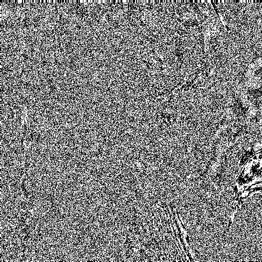
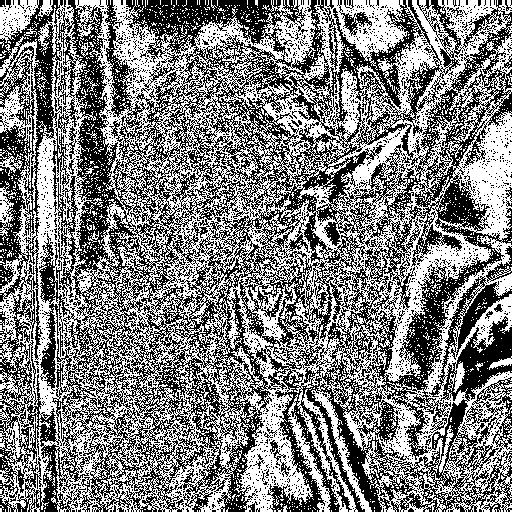

# Bitplane-slicing-of-an-image
Split a 8-bit image into 8 bit planes

<table>
  <tr>
    <td align="center">input image</td>
  </tr>
  <tr>
    <td align="center"></td>
  </tr>
   <tr>
    <td align="center">Bit plane 0</td>
    <td align="center">Bit plane 1</td>
    <td align="center">Bit plane 2</td>
    <td align="center">Bit plane 2</td>
  </tr>
  <tr>
    <td valign="top"></td>
    <td valign="top"></td>
    <td valign="top"></td>
    <td valign="top"></td>
  </tr>
    <tr>
    <td align="center">Bit plane 4</td>
    <td align="center">Bit plane 5</td>
    <td align="center">Bit plane 6</td>
    <td align="center">Bit plane 7</td>
  </tr>
  <tr>
    <td valign="top"></td>
    <td valign="top"></td>
    <td valign="top"></td>
    <td valign="top"></td>
  </tr>
 </table>
